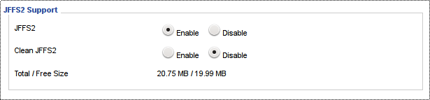

# ASUS Dynamic DNS toolkit for dd-wrt
This repository contains ASUS DDNS toolkit [asus-ddns.tgz](pkg/asus-ddns.tgz "current version") as command line helper 
scripts for handling ASUS DDNS operations like:
* [registration](#register-dns-record) - creating new DNS record
* [checking](#verify-dns-record) - active DNS record verification
* [updating](#update-dns-record) - an intelligent active DNS record update 

The main know-how comes from GitHub [BigNerd95](https://github.com/BigNerd95) repository [ASUSddns Project](https://github.com/BigNerd95/ASUSddns "ASUSddns on GitHub") 
 based on reverse engineered ASUS firmware. BigNerd95 implementation requires CURL to be installed. This implementation does not need any external packages (like CURL) to be installed. 
 The price to pay is limited error reporting capability based on dd-wrt internal [wget](http://svn.dd-wrt.com/browser/src/router/busybox/networking/wget.c "wget.c source") 
 implementation in busybox shell.
  
Despite reporting limitation this implementation supports:
  * full functionality for registering, updating and checking DNS records
  * simple installation
  * minimal network traffic footprint
  * minimal memory footprint in valuable internal flash memory
  * very efficient on router CPU, RAM (no cron jobs, etc)
  * configurable logging facility
  
Simple speaking:
 * you have CURL installed - use [ASUSddns Project](https://github.com/BigNerd95/ASUSddns "ASUSddns on GitHub") implemetation
 * no CURL installed - use [this](#asus-dynamic-dns-toolkit-for-dd-wrt) implementation

section links:
* [ASUS DDNS](#asus-ddns)
* [Security implications](#security-implications)
* [Implementation](#implementation)
* [Installation](#installation)
* [Dependencies](#dependencies)
* [Usage](#usage)
* [Register DNS record](#register-dns-record)
* [Verify DNS record](#verify-dns-record)
* [Update DNS record](#update-dns-record)
* [Delete DNS record](#delete-dns-record)
* [Get HW info](#get-hw-info)
* [Troubleshooting](#troubleshooting)
* [Possible problems](#possible-problems)
* [Configuration](#configuration)
* [Cheating](#cheating)
* [Credits](#credits)
* [History](#history)

### ASUS DDNS
[ASUS Dynamic DNS service (DDNS)](http://asusddns.blogspot.sk/ "ASUS DDNS") is free service provided by ASUS company for most ASUS routers. The service allows you to register custom
 unique name within ASUSCOMM.COM domain, for example myhome.asuscomm.com . The registration and updates are handled seemlessly
 by ASUS original firmware. However, by installing dd-wrt you will loose all this functionality as the dd-wrt firmware is
 supporting wide range of DDNS services except ASUS DDNS. 
 
Many publicly available **DDNS** services has mixed reputation for:
 * being not reliable
 * requiring tedious registration
 * requiring frequent updates to avoid DNS record expiration
 * offering free period only for limited time
 * licensing instability etc
 * various domains
 * not limited to particular device
 
On the other hand [ASUS DDNS](http://asusddns.blogspot.com/2014/09/whats-ddns.html) service:
 * no registration required (owning qualified ASUS device is sufficient)
 * extra long DNS record expiration (based on web search over two-three years)
 * no need for frequent updates (see above)
 * reliable DNS server
 * TTL 120 sec
 * free as long as you own ASUS device
 * limited to ASUSCOMM.COM domain

The registered name is assigned to the device hardware (MAC address and PIN code printed on the label on the bottom side of the device).
  In case of moving device the another location the assigned name management capability comes with the device. Therefore is 
  wise to keep MAC and PIN on record to keep management capabilities for assigned name (see [Cheating](#cheating) section for details).

### Security implications

As mentioned above the registered name is assigned to the device hardware (MAC/PIN). So keep in mind:
 
    Whoever knows your MAC address and PIN code controls your ASUSCOMM.COM DNS record
     
Do not relay any security asumption on actual DNS record. Always use additional layer of security like certificates,
  ssh tunnel, VPN, etc. Any moderate hacker can hijack your DNS record in ASUSCOMM.COM domain (even by social engineering
  or even by brute-forcing your MAC and PIN).
    
### Implementation

As mentioned above the dd-wrt GUI do not have any support for ASUS DDNS service. Despite having custom configuration
 for DDNS [ASUS DDNS](http://asusddns.blogspot.com/2014/09/whats-ddns.html) is so different so dd-wrt customization cannot be easily and efficiently used. Presented solution 
 is limited to command line only so no GUI visibility is implemeted. GUI integration would require much more internal
 dd-wrt knowledge ... 

All the communication to ASUS NS server is handled by dd-wrt built-in implemetation of [wget](http://svn.dd-wrt.com/browser/src/router/busybox/networking/wget.c "wget.c source").
 Unfortunately this dd-wrt implementation lacks any ability to return server http response code back (like 2XX, 3XX codes). 
 Using this built-in wget eliminates the need to install external utility like curl as used in original [BigNerd95](https://github.com/BigNerd95/ASUSddns) implementation. 
 That makes it possible to use this ASUS DDNS toolkit also on routers with limited free internal flash memory without active Optware ipkg packaging system. 

Due to minimize flash memory footprint only terse comments are in the script itself. The structure and variable names should
 help to self-document the code. More comments are available in [Configuration](#configuration) section.
 
In case of any problems please consult the section [Troubleshooting](#trubleshooting). Once ASUS DDNS toolkit is setup correctly, the 
 presented solution works flawlesly as you will see bellow.

### Installation

There are two ways to install this ASUS DDNS toolkit package [asus-ddns.tgz](pkg/asus-ddns.tgz "current version"):
* manually copy files to required locations - for advanced dd-wrt users 
* package - unpack the provided package [asus-ddns.tgz](pkg/asus-ddns.tgz "current version") (recommended way to install, assumes JFFS active)

example of installation to gateway router:

1) copy package [asus-ddns.tgz](pkg/asus-ddns.tgz "current version") to the router /tmp directory (or any other writable dir like /jffs):
```
    > scp asus-ddns.tgz gateway:/tmp/
```
  
2) login to the router and extract the package: 
```
    root@gateway:/# tar zxvf /tmp/asus-ddns.tgz -C /
    jffs/bin/
    jffs/bin/asus-ddns.sh
    jffs/etc/
    jffs/etc/config/
    jffs/etc/config/ddns.ipup
```

The package [asus-ddns.tgz](pkg/asus-ddns.tgz "current version") contains only two scripts:

###### asus-ddns.sh
 * the main cli script to handle all ASUS DDNS functionality
 * placeed to /jffs/bin (automaticaly located in PATH)

###### ddns.ipup
 * scipt to be executed by dd-wrt on state change (consult [dd-wrt WiKi](https://www.dd-wrt.com/wiki/index.php/Script_Execution) for details)
 * placed to /jffs/etc/config (executed when ppp interface going up)
 * contains just call to ASUS DDNS update with logging enabled: 
   * asus-ddns.sh -log update
 * alternatively **ddns.ipup** could be renamed to **ddns.wanup**
   but .ipup feels more appropriate (have tested both variants and they are fully functional)
     
### Dependencies

[JFFS](https://www.dd-wrt.com/wiki/index.php/JFFS) - The installation package [asus-ddns.tgz](pkg/asus-ddns.tgz "current version") expects 
/jffs file system active on the router. JFFS has to be enabled on dd-wrt page **Administration / Management** in section **JFFS2**
 


_Advanced users can install package [asus-ddns.tgz](pkg/asus-ddns.tgz "current version") into /tmp (or any other) dir to avoid using JFFS at all._

### Usage

Execution asus-ddns.sh without any parameter shows usage help:

    usage: asus-ddns.sh [-m mac] [-i 1.2.3.4|auto] [-p PIN] [-log] (check|update|register|wget) [name]
    
    where parameters are:
    -m mac  ... optional MAC address of WAN interface (default value from nvram wan_hwaddr )
    -i ip   ... optional ip  address of WAN interface (default value from nvram wan_ipaddr )
                'auto' is to obtain ip address from external service defined in AUTO_IP (http://api.ipify.org/)
    -p pin  ... optional ASUS WPS PIN code (default value from nvram secret_code) also on ASUS sticker
    -l      ... optional logging to syslog (default to stdout)
    action  ... any action (default just print info)
                check       ... check active DNS record for name
                update      ... update active DBS record for name
                register    ... register new DNS record for name
                wget        ... troubleshooting 
    name    ... name (hostname or FQDN) for DDNS record (after first successful registration optional)
    
Each parameter can be specified by one character (terse) option or by more descriptive option. The following options lines are identical:

    -m 11:22:33:44:55:66        -mac 11:22:33:44:55:66
    -i 111.222.33.44            -ip 111.222.33.44
    -p 123456                   -pin 123456 
    -l                          -log                            

All printout goes to stdout by default which is suitable for troubleshooting. Optional syslog logging is activated by
 parameter -l or -log. The order of parameters is not important. If provided more than once, the last one wins.

As always, please use common sense when doing ASUS DDNS service updates:

* the wrongest way - schedule a cron to do a [raw wget](#troubleshooting) update every minute. 
  This should be considered as serious DDoS attack on ASUS DNS infrastructe. 
* the wrong way - schedule frequent (like every 5,10,15 min) cron [raw wget](#troubleshooting) updates 
* acceptable way - schedule periodic cron updates by [asus-ddns.sh update](#update-dns-record) 
* the right way - execute update only on wan ip address change as implemented by ddns.ipup or ddns.wanup (by proper naming and location)
  
### Register DNS record

The first time we have to register our name to create brand new DNS record. This is one time process and is the most 
 difficult step of the process due to lack of returning http code by built-in dd-wrt [wget](http://svn.dd-wrt.com/browser/src/router/busybox/networking/wget.c "wget.c source"). 

The key to successfull registration is the right selection of valid name (hostname). 

Valid DNS hostnames:
 * should contain only alpha-numeric characters
 * underscores are supported but is better to avoid them
 * hyphens are not supperted and are usualy translated
 * dots '.' are not allowed
 * should not contain national/ascented chars despite being somehow supported by many DNS servers
 * has to be unique within ASUSCOMM.COM domain
 * should be as short as possible to avoid typos
 * should be as long as needed to be unique

preferred usage (on ASUS router):

    # asus-ddns.sh register myhome

explicit usage (on any linux device):

    # asus-ddns.sh -mac 11:22:33:44:55:66 -ip 111.222.33.44 -pin 123456 register myhome

#### Verify DNS record

preferred usage (on ASUS router):

    # asus-ddns.sh check
    CHECK - dns.name:myname.asuscomm.com dns.ip:195.12.10.113 = wan.ip:195.12.10.113 - match OK

explicit usage (on any linux device):

    # asus-ddns.sh -mac 11:22:33:44:55:66 -pin 123456 -ip 1.2.3.4 check myhome
    CHECK - dns.name:myname.asuscomm.com dns.ip:195.12.10.113 = wan.ip:1.2.3.4 - mismatch ERR

#### Update DNS record

Update first checks actual DNS record and executes update only if needed. This eliminates unnecessary connects
 to ASUS NS server in case of running scheduled frequent updates from cron.

preferred usage (on ASUS router):

    # asus-ddns.sh update
    UPDATE - dns.name:myname.asuscomm.com not needed as dns.ip:195.12.10.113 = wan.ip:195.12.10.113

explicit usage (on any linux PC):

    # asus-ddns.sh -mac 11:22:33:44:55:66 -pin 123456 -ip 1.2.3.4 update myhome
    UPDATE - dns.name:myname.asuscomm.com old.ip:195.12.10.113 -> new.ip:1.2.3.4
    
The ASUS DNS is using TTL=120 sec. That means in average the updated record should expire from DNS cache in 60 sec. In 
 the worst case scenario the old cached record will expire in 120 sec = 2 mins. Some broken caching DNS server might 
 keep expired records longer. You can perform CHECK after update to verify that record was updated, but please consider 
 TTL and do sleep at least TTL seconds between UPDATE and CHECK to get conclusive result.

#### Delete DNS record

ASUS do not provide any modality to delete existing DNS record. Based on few forum discussions the once created record is
 kept on DNS server for years (like 2-3 years). So do not relay on expiration. many public DDNS services will expire record
 if not updated frequently. This is not the case of ASUS DDNS. As we know that name is bound to device HW the only
 way to relase already bound name is to unbound it. Follow these steps to make existing bound name available (unbound):
  
* you **have access** to the device to which the name is bound:
  * use registration procedure to bind a new dummy name
  * old name will be unbound and become available again immediatly (after TTL)
* you do **not have acces** to the device to which the name is bound:
  * find MAC and PIN of device to which the name is bound
  * use white-hat cheating to bind new dummy name to this device
  * old name will be unbound and become available again immediatly (after TTL)

Based on official [ASUS Service Portal Tip](http://asusddns.blogspot.com/2014/09/how-to-re-use-your-ddns-hostname-on-new.html)

#### Get HW info

To get ASUS device HW info use 'info' action (this is the fallback action if not recognized as any valid action). This
 obviously works only on ASUS device

usage (ASUS router):

    # asus-ddns.sh info
    INFO wan.mac(11:22:33:44:55:66) wan.ip(1.2.3.4) pin(123456) user(0-F) pass(0-F)

usage on non ASUS router shows nothing usefull:

    # asus-ddns.sh info dummy
    ERR: Probabbly not ASUS router, missing wan.mac() pin()

#### Troubleshooting

To help troubleshooting use 'wget' action to get exact command line for two operations: 
* [register](#register-dns-record) - complete executable command line command using wget for registering
* [update](#update-dns-record) - complete executable command line command using wget for updating

Then you can simply copy and paste command line under investigation to any linux PC. As executed on linux PC wget shows deatiled
 error message to help you to identify and rectify the problem. Again, on dd-wrt this is not posiible due to simplistic
 implementation of [wget](http://svn.dd-wrt.com/browser/src/router/busybox/networking/wget.c "wget.c source"). 
 
 In the wget output look for the line **HTTP request sent, awaiting response...** where the response from the server is shown:
 
    Resolving ns1.asuscomm.com (ns1.asuscomm.com)... 103.10.4.108
    Connecting to ns1.asuscomm.com (ns1.asuscomm.com)|103.10.4.108|:80... connected.
    HTTP request sent, awaiting response... 233 |asus.asuscomm.com|name.asuscomm.com
    Length: unspecified [text/html]
 
Possible http responses are:
 
    200 OK                      ... success - everything OK
    203 ?
    220 ?
    230 ?
    233 FQDN1 FQDN2             ... request for FQDN1 but this device has bound FQDN2 
    297 Invalid Hostname        ... invalid hostname, consult section Valid DNS hostnames
    298 Invalid Domain          ... invalid domain (has to be asuscomm.com)
    299 Invalid IP format       ... invalid ip address (has to be ipv4)
    401 Authentication failure  ... incorrect MAC/PIN or non qualified ASUS device
    
Preferred REGISTRATION sequence:
1) [register](#register-dns-record) valid name
2) wait TTL
3) [check](#verify-dns-record) registration
4) registration OK - you are done, continue with TEST sequence
5) registration not OK: 
   * use [wget](#troubleshooting) option to get command line
   * copy and paste the first (register.jsp) line to linux PC
   * execute and check line 'HTTP request sent, awaiting response...' for error message
   * fix problem and start from 1) again
   
Preferred TEST sequence:
1) execute [update](#update-dns-record) - should report 'not needed ...'
2) enable syslog on dd-wrt management page if disabled
3) renew wan ip address:
   * disconnect WAN
   * wait
   * reconnect WAN
3) check log for asus-ddns update
4) wait at least TTL (2 mins)
5) [verify](#verify-dns-record) updated dns record

_Please note that extensive writes like syslog on the router will [wearout](https://www.dd-wrt.com/wiki/index.php/JFFS) 
flash memory faster (it is better to use remote syslog server)_
 
#### Possible problems

* JFFS is not available on the router:
  * install/extract scripts into /tmp dir (you have to solve boot persistence by yourself):    
    ```
    root@gateway:/# tar zxvf /tmp/asus-ddns.tgz -C /tmp
    ```
* command completion [ TAB ] in dd-wrt shell (busybox) does not auto-complete asus-ddns.sh
  * check execute permission for /jffs/bin/asus-ddns.sh:
    ```
    root@gateway:~# ls -l /jffs/bin/asus-ddns.sh
    -rwxrwxr-x    1 1000     1000          3247 Mar 19 20:44 /jffs/bin/asus-ddns.sh
    ```    
  * check PATH:  
    ```
    root@gateway:~# echo $PATH
    /bin:/usr/bin:/sbin:/usr/sbin:/jffs/sbin:/jffs/bin:/jffs/usr/sbin:/jffs/usr/bin:/mmc/sbin:/mmc/bin:/mmc/usr/sbin:/mmc/usr/bin:/opt/sbin:/opt/bin:/opt/usr/sbin:/opt/usr/bin
    ```
* my DDNS name is not updated immediately:
  * you have to wait max TTL time (120 sec), in average after time TTL/2 the DDNS record should be updated
    
* my DDNS name is not updated on ppp reconnect even after waiting TTL time:
  * check remote syslog on linux PC for UPDATEs:
    ```
    $ grep UPDATE /var/log/syslog
    Mar 19 10:23:01 gateway dyndns: UPDATE - dns.name:my.asuscomm.com not needed as dns.ip:195.12.10.113 = wan.ip:195.12.10.113
    ```    
  * execute update manually from command line:
    ```
    root@gateway:~# asus-ddns.sh update
    UPDATE - dns.name:ticha10.asuscomm.com not needed as dns.ip:195.12.10.113 = wan.ip:195.12.10.113
    ```  
  * check execute permission for etc/config/ddns.sh:
    ```
    root@gateway:~# ls -l /jffs/etc/config/
    -rwxr-xr-x    1 1000     1000            34 Mar 19 20:10 ddns.ipup  
    ```
    
#### Configuration

Config values are global shell variables (you shoudn't need to touch any of these):

    # version info
    VER=2017.3
    
    # URL to retrieve wan ip if ip parameter 'auto' is specified
    AUTO_IP=http://api.ipify.org/
    
    # key to store registered FQDN DNS name in nvram (empty for no store functionality) 
    NVRAM_DNSNAME=wan_dnsname
    
    # ASUS domain for DDNS service
    DOMAIN=asuscomm.com
    
    # ASUS name server for handling DDNS requests
    NS=ns1.$DOMAIN
    
    # user agent header sent with requests
    UA='ez-update-3.0.11b5 unknown [] (by Angus Mackay)'
    
    # linux wget options for trubleshooting outside of dd-wrt busybox shell
    WGET_OPT='--auth-no-challenge --spider'
    
    # syslog tag
    LOG_TAG='dyndns'
    
    # default printouts to stdout
    OUT='echo'
    
    # FQDN dns_name
    DNS_NAME=${NAME%%.*}.$DOMAIN
    
    # ddns assigned ip for registered dns_name as returned by ASUS name server 
    DNS_IP=$(nslookup $DNS_NAME $NS ...)
    
    # URL for GET request to register(register.jsp) or update (update.jsp) DDNS record
    URL="$NS/ddns/$ACTION.jsp?hostname=$DNS_NAME&myip=$WAN_IP"

### Cheating

ASUS DDNS service is bound to ASUS qualified devices. therefore it should be used only from ASUS devices. However, 
there are situations like:
 
 * router damage
 * hardware malfunction
 * giving/selling the device to new owner
 * buying new device
 
when registered name bound to the device should be recovered and used again. This is a kind of _white-hat_ cheating.
 In this case feel free to use asus-ddns toolkit to handle registered name release and transfer. Please use common sense
 as abuse and misuse of ASUS free DDNS service could cause unwanted response (even shutdown of this service) from ASUS.
 See section [Delete DNS record](#delete-dns-record) how to use white-hat cheating to recover lost access to the registered name.  

### Credits
The main credit goes to [BigNerd95](https://github.com/BigNerd95 "BigNerd95 on GitHub") for his [ASUSddns Project](https://github.com/BigNerd95/ASUSddns "ASUSddns on GitHub")

### History
 version 2017.3 - the initial GitHub release in March 2017

**keywords**: dd-wrt, ddns, asus, RT-N16, dyndns, cli, shell, sh, busybox, wget, dns, jffs, ns, asuscomm.com, wan, ip

